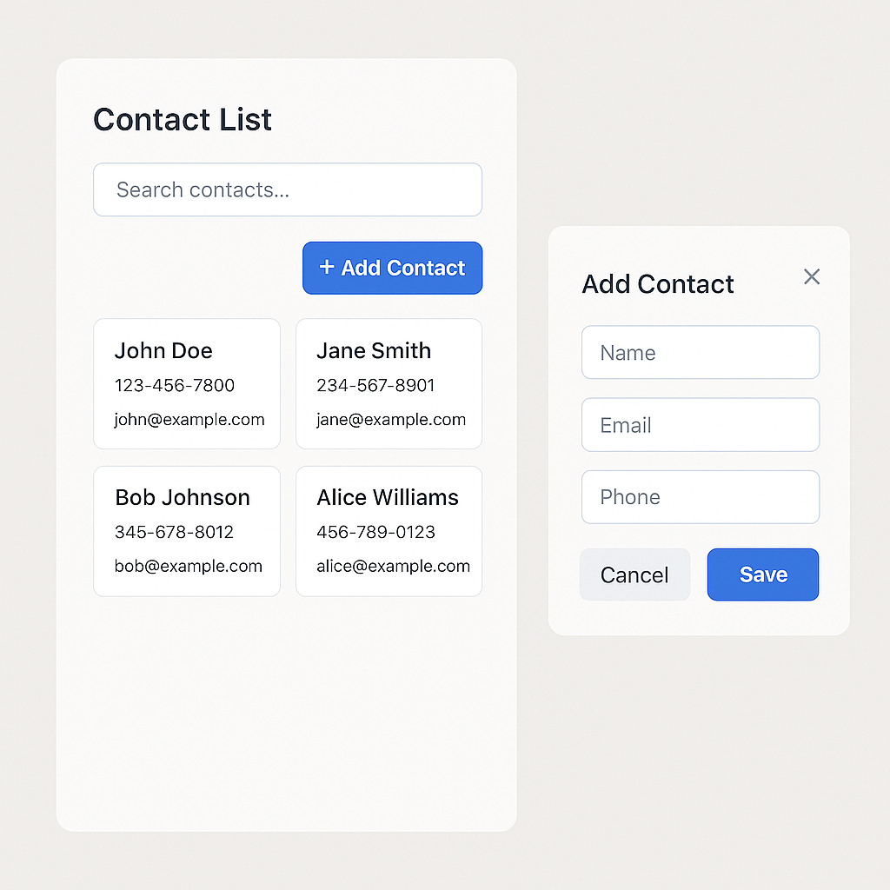

# Projeto: Agenda Web de Contatos

## ✨ Cenário Empresarial

A empresa fictícia **Connectly** quer lançar uma versão web de sua aplicação de contatos. O MVP (Produto Mínimo Viável) deverá permitir que usuários adicionem, visualizem e filtrem contatos.

Você foi contratado como desenvolvedor front-end júnior para criar esse MVP com base no layout fornecido e nos requisitos abaixo.

---

## 📘 Especificação do Projeto

### 🖐 Requisitos Funcionais

#### Página Principal: Lista de Contatos

- [ ] Exibir lista de contatos em cards responsivos (Grid/Flexbox).
- [ ] Cada card deve mostrar: Nome, Telefone, Email.
- [ ] Campo de busca no topo para filtrar por nome (JS DOM).
- [ ] Botão "Adicionar Contato" abre um formulário modal.

#### Modal: Adicionar Novo Contato

- [ ] Nome (obrigatório), Email, Telefone.
- [ ] Validação de campos (nome obrigatório, email válido se preenchido).
- [ ] Ao enviar, o contato é adicionado à lista na tela (sem recarregar).

### 🎨 Requisitos Visuais (CSS)

- [ ] Design responsivo (flexbox/grid).
- [ ] Tipografia limpa (fontes seguras ou Google Fonts).
- [ ] Espaçamento consistente (padding, margin).
- [ ] Diferenciação clara entre estado vazio e lista com contatos.

### 🧠 Requisitos Técnicos (JS)

- [ ] Todos os contatos salvos ficam em um array no `localStorage`.
- [ ] Filtro em tempo real com `input.addEventListener('input', ...)`.
- [ ] Use manipulação de DOM pura (sem frameworks).
- [ ] Organização do código em funções reutilizáveis.

### 🛠 Extras (Opcional)

- [ ] Edição e exclusão de contatos.
- [ ] Validação visual com bordas vermelhas e mensagens de erro.
- [ ] Animações com `transition` para entrada do modal.
- [ ] Dark mode com botão de alternância.

---

## ✅ Critérios de Aceite

- [ ] Interface responsiva e funcional em mobile e desktop.
- [ ] Código limpo, comentado e organizado.
- [ ] Sem erros no console do navegador.
- [ ] Experiência fluida: não precisa recarregar a página.

---

## 📋 Checklist Resumido

### 🔲 Layout e Funcionalidade

- [ ] Cards de contatos com nome, telefone e e-mail
- [ ] Campo de busca para filtragem
- [ ] Modal com formulário de novo contato

### 🎨 HTML/CSS

- [ ] Layout com Grid ou Flexbox
- [ ] Tipografia e espaçamento consistentes
- [ ] Responsivo em mobile e desktop

### 💡 JavaScript

- [ ] Adição e filtro de contatos com manipulação de DOM
- [ ] Armazenar contatos no `localStorage`
- [ ] Validação de campos

### 🌟 Extras

- [ ] Edição/remoção de contatos
- [ ] Validações visuais e feedbacks
- [ ] Dark mode
- [ ] Animações de transição

---

## 📁 Estrutura Sugerida do Projeto

```plaintext
agenda-web/
├── index.html
├── style.css
├── script.js
└── assets/
    └── icons/
```

## 🏠 Esboço

## 
